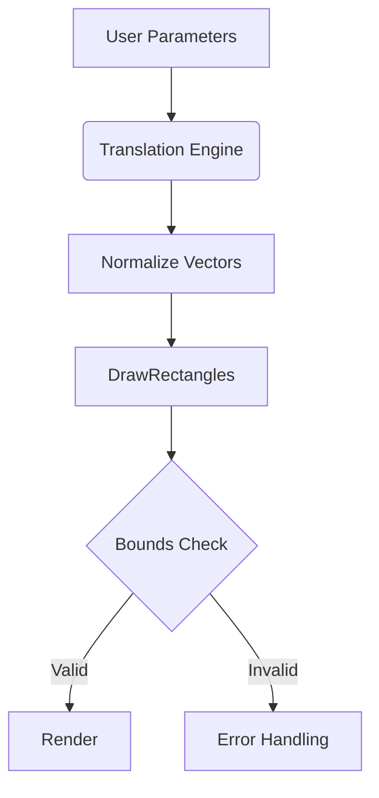

## 🖥️ Core Architecture

```mermaid
graph TD
    A[User Parameters] --> B(Translation Engine)
    B --> C[Normalize Vectors]
    C --> D[DrawRectangles]
    D --> E{Bounds Check}
    E -->|Valid| F[Render]
    E -->|Invalid| G[Error Handling]
```
**Flow Explanation**:  
- Input parameters → Vector normalization → Iterative rendering
